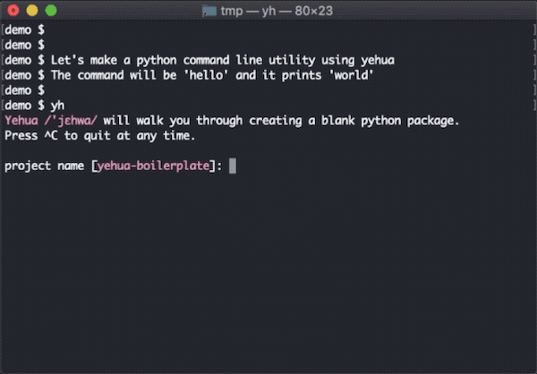
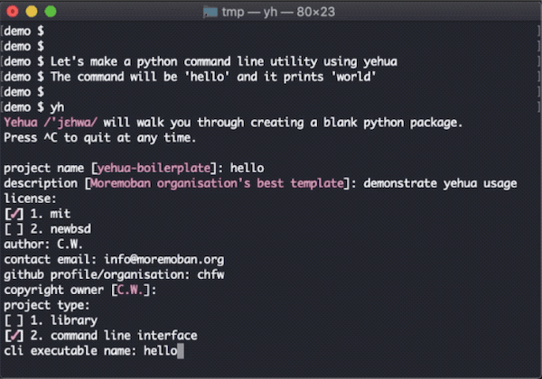
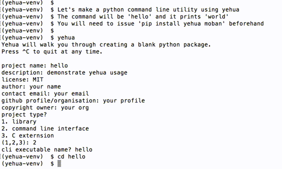
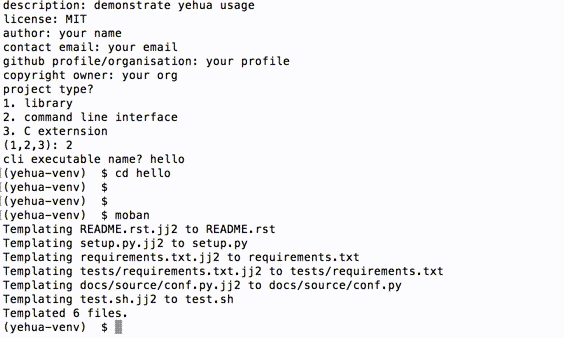
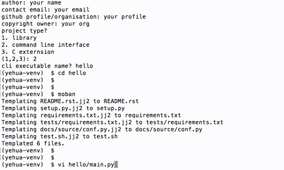
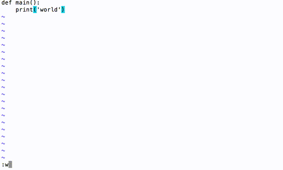
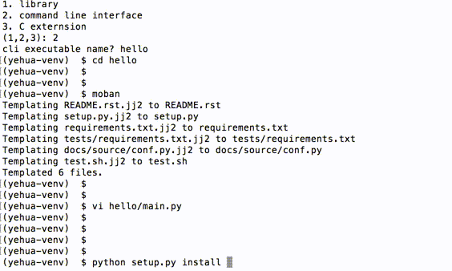
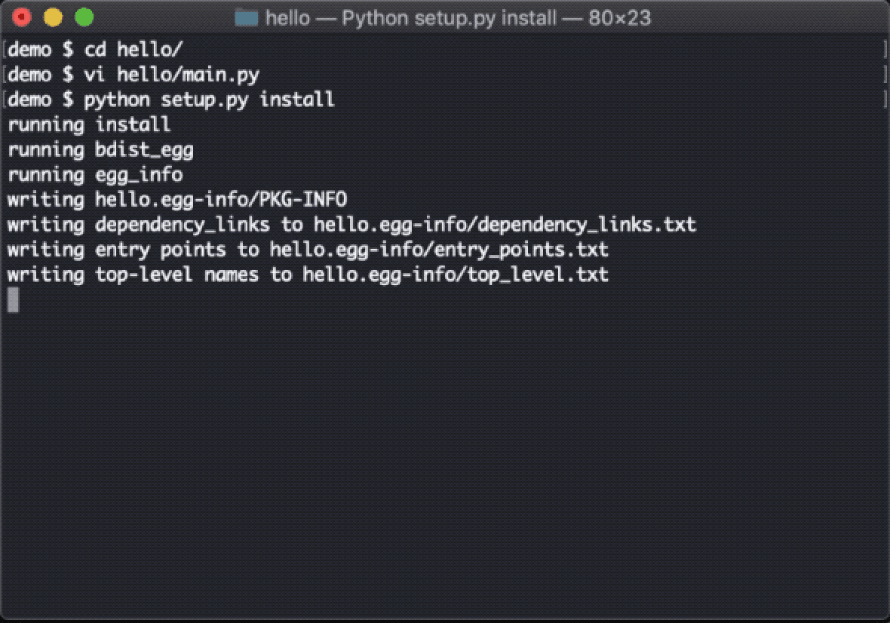
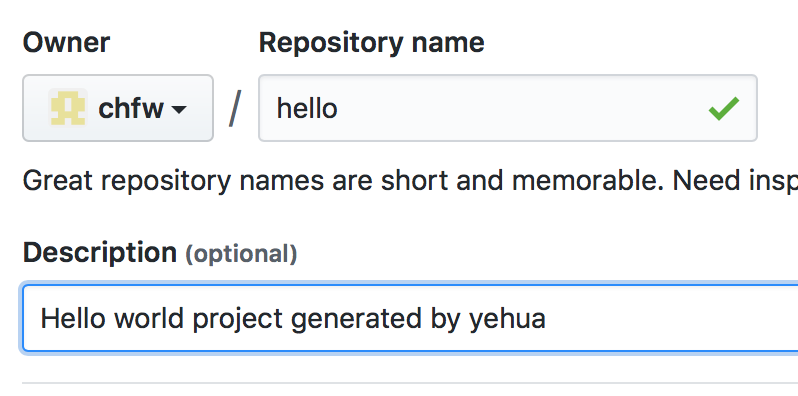
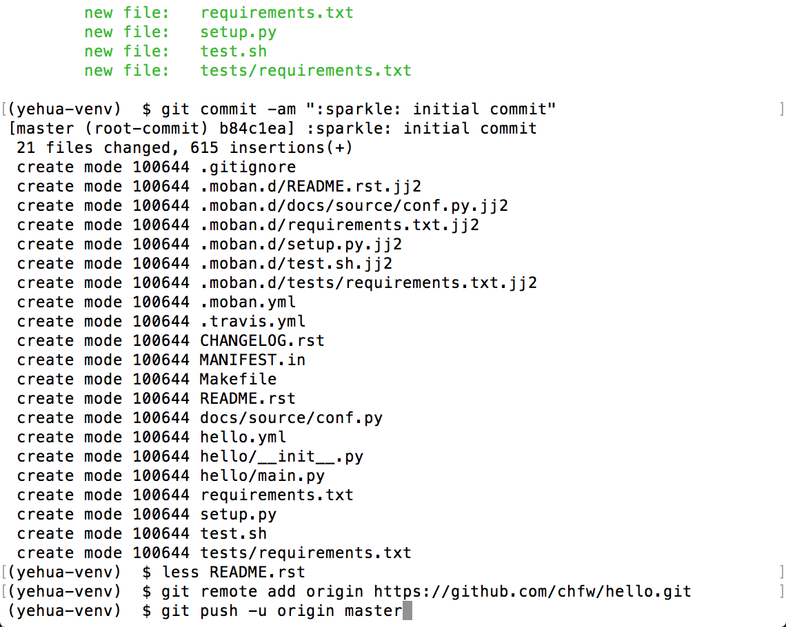

================================================================================
yehua - Let you focus on code, instead of setup scaffolding
================================================================================

.. image:: https://api.travis-ci.org/moremoban/yehua.svg
   :target: http://travis-ci.org/moremoban/yehua

.. image:: https://codecov.io/github/moremoban/yehua/coverage.png
   :target: https://codecov.io/github/moremoban/yehua

.. image:: https://readthedocs.org/projects/yehua/badge/?version=latest
   :target: http://yehua.readthedocs.org/en/latest/

.. image:: https://badges.gitter.im/chfw_yehua/Lobby.svg
   :alt: Join the chat at https://gitter.im/chfw_yehua/Lobby
   :target: https://gitter.im/chfw_yehua/Lobby?utm_source=badge&utm_medium=badge&utm_campaign=pr-badge&utm_content=badge

Introduction
================================================================================

* Are you tired of writing up setup.py files by hand? Have you ever wondered why
  pypi displays raw rst file for your README?
* When you add a new library to the collection of your organization, how would
  you make sure the static information are the same as others?
* How would you update static information across all packages of your
  organisation? For example, one line change in your company's profile.
  Copy and paste? If yes, you still live in 20th century.

**yehua** is an interactive command line tool to provide a default scaffolding for a python package. The name is the pinyin of the Chinese word
“夜华”, /'jɛhwa/. It create a blank python package that is usable and ready to push to github. And future
updates on your organisation's specific static information can be instantly applies the
update accurately using `moban`_. Here is a list of features:

#. core python package
#. test configuration setup
#. ready to commit github repository
#. automated upload to pypi through twine
#. version management through jinja2
#. automated github release through gease
#. permanent parent-child bond: keep your packages in synchronization with your template forever

What's more, you can provide your own python package templates and your own
yehua file to customize **yehua** to meet your own needs. Here are a list of
examples:

* `pypkg-mobans in pyecharts project <https://github.com/pyecharts/pypkg-mobans>`_
* `echarts-js-mobans in echarts-map project <https://github.com/echarts-maps/echarts-js-mobans>`_

Feature comparision
--------------------------------------------------------------------------------

The following table is a personal feature comparision. If you have a different
opinion, especially you are the author of the following repository, please
raise an issue and we can talk. This table is not a commerical sales pitch.

#. Y: have such a feature
#. M: manual operation
#. A: automatic operation

.. table:: Detailed feature comparision

    ============== ========================== ======================= ===================== ========== =====
    Group          Feature                    cookiecutter-pypackage  cookiecutter-vanguard PyScaffold yehua
    ============== ========================== ======================= ===================== ========== =====
    essential      setup.py                   Y                        Y                     Y         Y
    .              setup.cfg                  Y                        Y                     Y         Y
    .              source code stub           Y                        Y                     Y         Y
    test setup     requirements.txt                                    Y                     Y         Y
    .              requirements_dev.txt       Y                        Y                               Y
    .              Makefile                   Y                                                        Y
    .              tests code                 Y                        Y                     Y
    .              tox                        Y                                              Y
    .              travis                     Y                                              Y         Y
    .              test coverage                                       Y                               Y
    .              flake8                                                                              Y
    documentation  README.rst                 Y                                              Y         Y
    .              labels                                                                              Y
    .              gitignore                  Y                                              Y         Y
    .              AUTHORS.rst                Y                        Y                     Y
    .              CONTRIBUTING.rst           Y                        Y
    .              HISTORY.rst/CHANGELOG .rst Y                        Y                     Y         Y
    .              LICENCE                    Y                        Y                     Y         Y
    .              MANIFEST.in                Y                        Y                               Y
    .              sphinx docs                Y                        Y                     Y         Y
    usability      interactive shell          Y                        Y                               Y
    .              one liner                                                                 Y
    .              initialize github repo                                                              Y
    maintenance    publish on pypi            A                        M                               M
    .              dependency management      M                                              M         A
    .              template customization                                                              Y
    .              version management         M                                              M         A
    .              automated github release                                                            Y
    .              continous templating                                                                Y
    ============== ========================== ======================= ===================== ========== =====

Comparing with cookiecutter, the difference comes in the later phase
of the created project. **moremoban** organisation assumes
the life time responsibility: keep its template always
up-to-date with its originating template, for the created project.
Whereas, the templates of cookiecutter are disconnected once
the project has been created successfully. In my personal experience
(maintaining pyexcel), I am finding that the documentation
changes as well. For example, someone helped to correct my spellings
in one of my project's documentation. Via moremoban's toolset, I can
upstream the spelling updates to pyexcel-mobans and propagate all
the spellings to the rest of the projects.

Comparing with PyScaffold, the first difference is the difference in
command line interface. Yehua prefers interactivity whereas PyScaffold
uses one liner. Why? I am influenced by yeoman, the scaffolding tool
for front end developers. I am convinced that conversational style
does lower the entry barrier for new comers, because the question on
the left hand side is a self-explantory sentence so the user does
not need to read up the user manual. The second difference is that
Yehua has an interface layer(YEHUA_FILE) which cuts its ties with its own
built-in templates, which means you instruct yehua to make a npm package
if your custom YEHUA_FILE instructs. That's an extreme. The third difference
is that its own templates(I called it mobans) can be overriden/customized
by another set of templates/mobans. For example, pyexcel project has
pyexcel-mobans, which overlays on top of pypi-mobans. pyexcel-mobans
is more concerned of pyexcel project's documentation.

Installation
================================================================================

You can install yehua via pip:

.. code-block:: bash

    $ pip install yehua

or clone it and install it:

.. code-block:: bash

    $ git clone https://github.com/moremoban/yehua.git
    $ cd yehua
    $ python setup.py install

Usage
================================================================================

.. image:: https://github.com/chfw/yehua/raw/master/yehua-usage.gif
   :width: 600px

Please note, since version 0.0.2, the command line is shortened. Due to
time constaints, the demo video uses `yehua` still.

Simply type in and you are taken care of::

    $ yh

It will do these for you:

#. Consult you on your project static information which can update as
   many as you want to.
#. Create the Python package folder structure
#. Initialize the package as git project

You will simply need to commit it after you will have reviewed the
generated files.

Tutorial
-----------------

Let's make a python command line utility using `yehua`. The command
will be `hello` and it prints `world`. You will need to issue::

    $ pip install yehua

before proceeding.

Step 1 Let's launch yehua
******************************
|slide1|

Step 2 Fill-in the meta data for your project
***********************************************
|slide2|

At the end, yehua generates a folder named 'hello', which contains all necessary
files for

#. installing it as a package
#. testing via nose
#. sharing it on github
#. configuring travis via github

Step 3 Inflates the meta data
**********************************
Let's change to 'hello' directory

|slide3|

All meta data is inflated via **`moban`_ automatically**
The templates come from `setupmobans`_
Run moban. It inflates the all meta data.

|slide4|

Why is moban involved here? It helps reduce duplicated meta data when
your project grows. For example, yehua had this tutorial in README and in sphinx
documentation. I wrote it in one file and moban copies it to both
places. What's more, it helps further when the number of your
project grows. For example, `pyexcel`_ project has dozens of
sub projects. I wrote most of the generic documentation in
`pyexcel commons`_ and moban copies them across all sub projects.

Step 4 Start coding
*************************
Let's write up the actual code in hello/main.py

|slide5|

Put in just a main() function and save it.

|slide6|

Why is it enough? yehua generates a command utility python and
it has pre-wired to invoke hello.main.main() function. You
can find it out in setup.py.

Step 5 Install it
*********************
Now all is done. Let's install it

|slide7|

Step 6 Run it
********************

Let's run it

|slide8|

All done.

Step 7 push to github
***************************

Suppose you are happy with everything. Please do the following to
push it to your github::

    $ git init
    $ git add *
    $ git add .gitignore .moban.d/ .moban.yml .travis.yml
    $ git commit -am ":sparkle: initial commit"

Then create your project repository in github and do these to push it out::

    $ git remote add origin https://github.com/chfw/hello.git
    $ git push origin master

You can find the `hello project`_ on github.

Step 8 enable travis
***************************

The generated project already has `.travis.yml` file. What you
will need to do is to register with travis.org if you have not
done so. And then go to travis and activate your project. 

.. _hello project: https://github.com/chfw/hello
.. _pyexcel commons: https://github.com/pyexcel/pyexcel-commons
.. _pyexcel: https://github.com/pyexcel
.. _moban: https://github.com/moremoban/moban
.. _setupmobans: https://github.com/moremoban/setupmobans

Background
================================================================================

The original problem I was trying to solve is: I would like to place
common paragraphs in the documentation of my projects in a central
place (pyexcel-mobans), and all projects could reference it dynamically
so that when those common paragraphs get updated, the updates can be
easily propagated to all relevant projects. The derived problem is:
what could I do to a new project? I found myself doing a lot of
copy-and-paste a lot, which lead to the creation of "yehua". Later,
John Vandenberg, an active member of coala, suggested extracting the
generic sets of pyexcel-mobans to form pypi-mobans, so that
a vanilla python package can be created.

Why to choose "yehua"? Here is `the little story <https://github.com/moremoban/yehua/issues/5#issuecomment-317218010>`_ behind the choice of name. And this `music video <https://www.youtube.com/watch?v=_JFTOQ6F1-M&frags=pl%2Cwn>`_ would help bridge the cultural gap between you and me.

License
================================================================================

NEW BSD License
